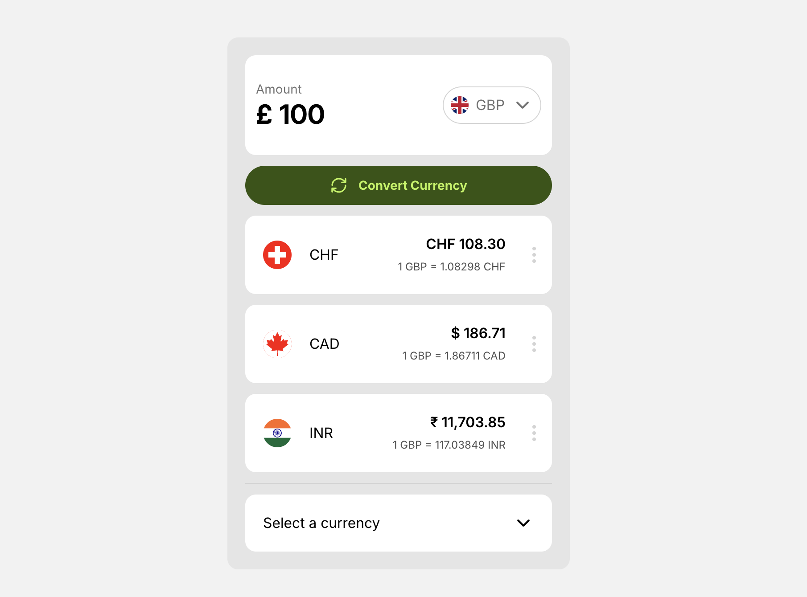
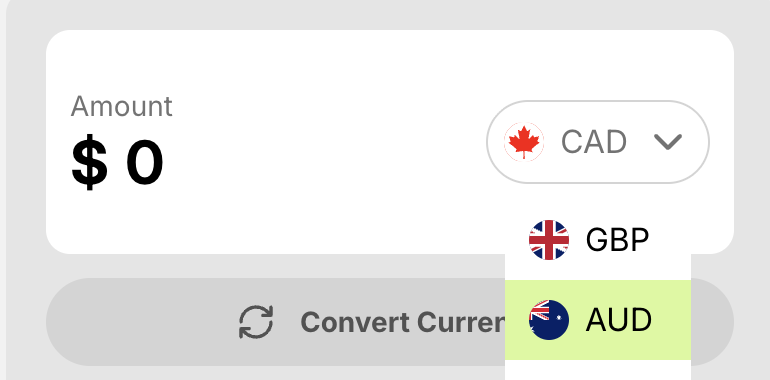
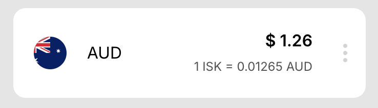
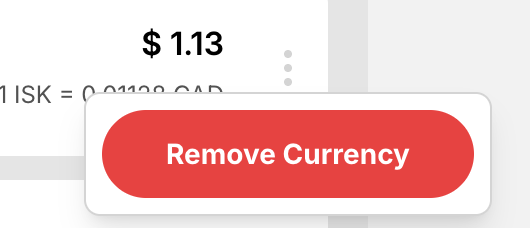
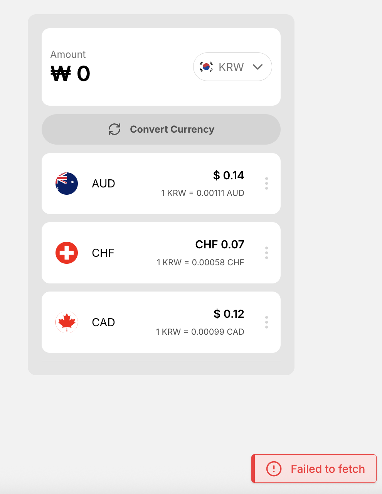
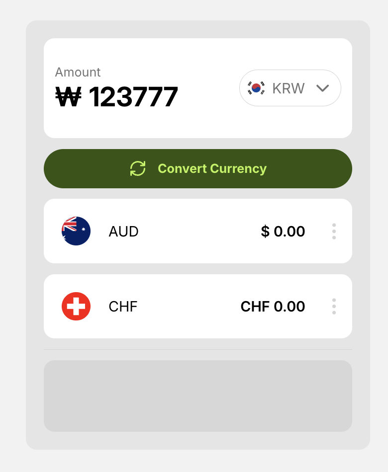
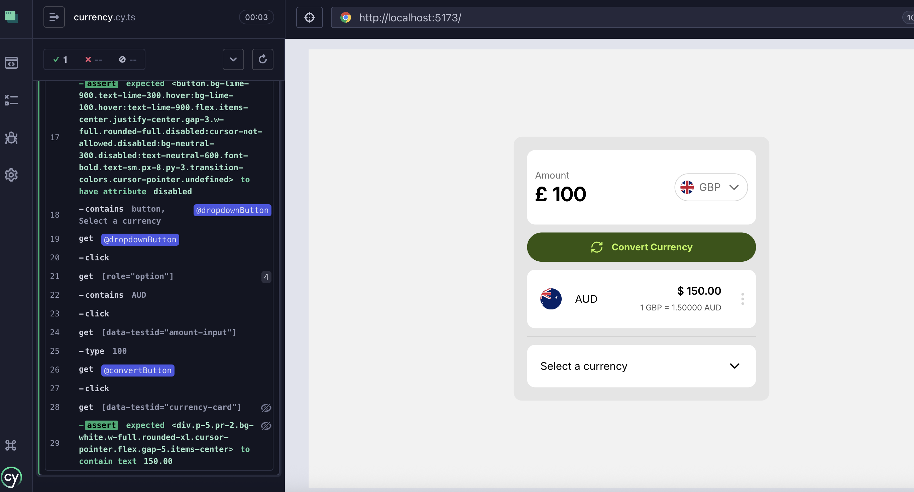

# Currency App



A React application for comparing and converting currencies. Users can select a base currency, add up to three comparison currencies, view real-time exchange rates, and perform conversions. The app features smooth animations, robust error handling, and a clean, accessible UI.

---

## 🚀 Getting Started

### Development

1. **Install dependencies:**
   ```sh
   pnpm install
   ```
2. **Start the development server:**
   ```sh
   pnpm run dev
   ```
   The app will be available at [http://localhost:5173](http://localhost:5173).

### Production

1. **Build the app:**
   ```sh
   pnpm run build
   ```
2. **Preview the production build locally:**
   ```sh
   pnpm run preview
   ```
   Or serve the contents of the `dist/` directory.

---

## 🗂️ Project Structure

```
currency-app/
├── public/                # Static assets
├── src/
│   ├── api/               # API utilities (e.g., getExchangeRates)
│   ├── components/        # Reusable React components (Dropdown, CurrencyCard, etc.)
│   ├── lib/               # Shared hooks and utility functions
│   ├── stores/            # Redux slices and store setup
│   ├── App.tsx            # Main application component
│   └── main.tsx           # Entry point
├── tests/                 # Unit and component tests
├── cypress/               # E2E tests with Cypress
└──
```

---

## 📦 Main Dependencies

- **Tailwind CSS** - Styling
- **Redux Toolkit** – State management
- **React Query** – Data fetching and caching
- **Headless UI** – Accessible UI primitives (dropdowns, menus)
- **Motion** – Animations
- **Jest** & **React Testing Library** – Testing
- **Cypress** – E2E Testing

---

## Introduction

Since there is only one feature in this application, I wanted to keep it simple, so I stuck with **vanilla React** with **Vite**. I could have opted for **Next.js**, however in this case there was not much need for some of that framework’s advanced features like API routes and SSR.

I like **Vite** because it:

- Comes with built-in **TypeScript** support
- Is super fast in development bundling
- Makes it quick and easy to get **Tailwind** installed
- Pairs well with **Vitest** for testing

I opted for **pnpm** as my package manager, as this is what I have used on production projects due to its:

- Speed
- Space efficiency
- Security

### Structure

The app doesn't have any routing as it is all based out of the App.tsx file.
The majority of directories in the project do not contain much code or many files, as the project is small. But I wanted to follow a structure I felt would be scalable if the project were to grow larger.

I have a directory for components that separates them into common UI components or feature specific.

There are directories for utility functions, library realted code, constants, redux stores, assets etc.

## Design

### Design Approach

As there was no design provided, I didn’t want to spend too much time creating a complex design myself. Instead, I kept the UI fairly simple — clean yet professional.

I took inspiration from existing brands in the currency space, such as **XE** and **Wise**. Using these apps as benchmarks was a good UX decision, as it allows users to engage with the app intuitively. Since it follows familiar and conventional user flows, there’s little to no learning curve for users.

### UI/UX Decisions

From analyzing existing solutions, I learned that placing the **base currency at the top** is best practice. This ensures clarity and aligns with user expectations.



Additionally, displaying a **flag alongside the currency code** is both visually pleasing and aids comprehension, making it easier for users to quickly identify the correct currency.

### Currency Selection

Underneath the base currency, the user can select **other currencies** they want to convert to. These are displayed in cards that are styled differently from the base currency card to **assert difference and hierarchy**. Like the base currency, these cards also display the flag for the same usability benefits.



The user can load a total of **three other currencies** at one time. While in a production scenario I would not impose this restriction, I introduced it here deliberately to:

- Test my custom **Toast component** (described later).
- Add a constraint that simulates handling edge cases.
- Encourage use of the remove feature, where users can manage their currencies.



Due to time constraints, I did not design for scenarios where a large number of currencies are loaded. This is an area I would expand and refine in future iterations.

The project brief stated that users should click the button to run the currency conversion, however, if it were my own decision I would have live conversion when the user enters the amount into the input, as this is more standard based on other applications in the domain.

### Validation

For this project I implemented simple validation logic directly on the input field.

In a production application, I would likely use a form library such as React Hook Form in combination with a validation library like Yup or Zod. This would provide more scalable validation across multiple fields, better error handling, and improved experience.

However, since this application only contained a single input field and the requirement was to connect it directly to the Redux store, there was no need for a full form library. Instead, validation was achieved using a regular expression and a few conditional checks inside the submit handling function.

This approach kept the implementation lightweight while still enforcing the necessary input rules.

I disabled the button upon invalid input, and if the user tries to enter via keyboard and hitting enter, they will be met with a feedback message in the form of a toast component.

### Animation

From research I found that existing products made use of simple yet effective animation, providing a great user experience. I wanted to implement this to some extent too, so I decided to Motion as an animation library as it is quite easy and fast to get simple UI animations up and running.


### Styling

I used **Tailwind CSS** as it’s a contemporary solution that provides an excellent developer experience. With Tailwind, I can keep styles **modular, consistent, and easy to maintain**.

Although I didn’t make use of a custom Tailwind configuration in this project, it’s something I would typically implement in larger or production-grade projects.

## Data Fetching

#### Axios

I chose to use Axios as the HTTP client for this application. Although this is a relatively simple app, I aimed to use production-quality dependencies wherever appropriate. I have worked with Axios a lot and I like its intuitive API, interceptor support, automatic JSON transformation, and better error handling out of the box compared to fetch.

#### React Query

I used React Query to manage data fetching and caching in the app. Even though this is a small project, I like using React Query to handle server state. Caching, background refetching, request deduplication, and loading/error states are something I have made use of regularly in past projects. I find the query invalidation to be very convenient, although I had no use for it in this app.

For error handling I show a toast whenever the API returns an error, using the toast store and provider. For loading states I show a skeleton with pulse animation for the parts that depend on the API response, as this is a modern and user friendly way to do it




## State Management with Redux

I hadn’t used Redux in a few years, as tools like React Query (for server state) and lightweight solutions like Zustand have covered most of my state management needs. However, with the addition of Redux Toolkit the Redux ecosystem has become much more developer-friendly, and implementing it into this project was smooth and easy. I chose it here because it is also the recommended approach by the Redux documentation.

### Stores

I created two separate stores:

1. **Currency Store**

   - Stores the user’s selected currencies, the base currency, and the currency amount.
   - This is especially useful because I can access the data across different parts of the application.
   - The base currency code is also fed into React Query as a **query key**, which triggers a data refetch whenever the base currency changes.
   - Unlike using React Context, Redux ensures that only components consuming the state re-render, rather than propagating re-renders through the entire app.

2. **Toast Store**
   - Manages application toasts/notifications.
   - This was used to test constraints in the UI (e.g., limiting the number of additional currencies a user can select).

### Persistence

To improve the user experience, I combined the Redux store with localStorage. This allows selected currencies and amounts to persist across tabs, browser refreshes, and sessions, making the app feel more robust and production-ready.

## Accessibility

Accessibility was a key priority for this project. I wanted to ensure the application could be used effectively by all users, including those relying on assistive technologies.

This video demonstrates full keyboard usage of the app:

<video width="500" controls>
  <source src="public/record-2.mov" type="video/mp4">
</video>

- The app is fully keyboard accessible, meaning every interactive element can be reached and operated without a mouse.
- I ensured screen reader (SR) support by using appropriate ARIA attributes wherever necessary, such as for interactive components, error messages, and form controls.
- To enhance clarity for screen reader users without affecting the visual design, I added several `sr-only` elements. These provide additional context (e.g., describing currency values or button purposes) that might not be obvious from visual cues alone.

By incorporating these practices, the UI is both visually clean and compliant with accessibility standards, making it intuitive for sighted users while remaining inclusive for those using assistive technologies.

I decided to use Headless UI’s Listbox component because it offers fully accessible primitives out of the box. Unlike many UI libraries that come with heavy styling and rigid layouts, Headless UI components are:

- Completely unstyled – giving full control over the visual design, which pairs well with Tailwind CSS.
- they come pre-configured with proper ARIA attributes, keyboard navigation

## 🧪 Testing Style

- **Unit tests** for utilities and Redux logic (in `src/tests/`).
- **E2E tests** with Cypress for full user flows.
- Run tests with:
  ```sh
  pnpm test
  pnpm cypress open
  ```
  For testing I wanted to combine a few different types that I would use in a production application. Although I didn’t have time to do 100% test coverage, I wrote two test suites to give an example.

### Unit Tests

I chose to write unit tests with Vitest for the currencies reducer functions, as this is central to my business logic and is a great use case for unit tests. Vitest is great because I am already using Vite. I just needed to add jsdom to prevent the local storage use from throwing an error.

### End-to-End Tests

E2E tests are my favorite, and I do find them to be the most important for front-end applications, especially around core user flows. I used Cypress as I am familiar with it and I like the API. I decided to test the main user flow. However, if I had more time I would also test alternative flows such as erroneous actions, to ensure all flows are correctly implemented.



I stubbed the API response so that I could guarantee consistent tests.
